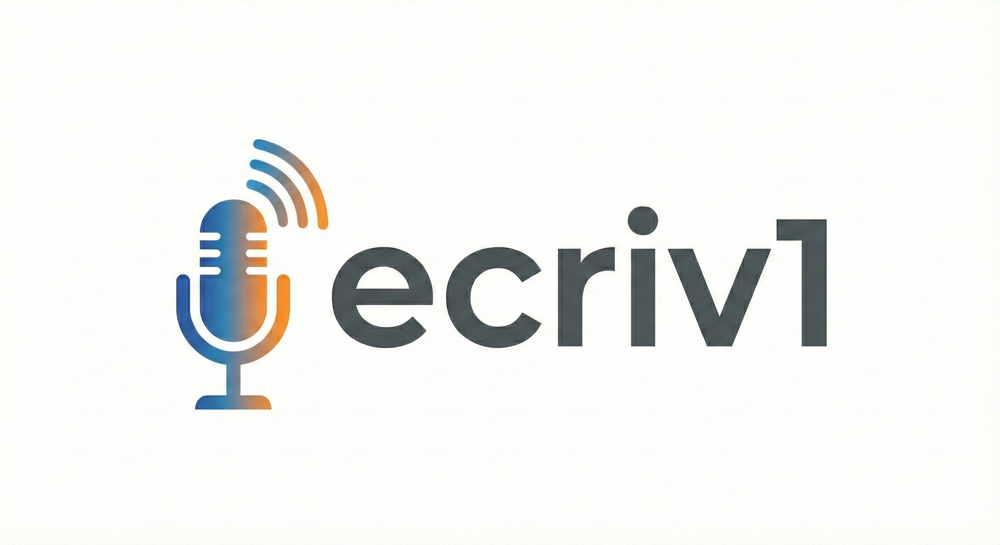

<p align="center">
  
</p>

# ecriv1

A lightweight Linux system tray widget for real-time French speech-to-text. Press F4 to start recording, and transcribed text is typed at your cursor position.

Uses [faster-whisper](https://github.com/SYSTRAN/faster-whisper) (medium model) running on GPU for accurate French transcription with punctuation.

## Requirements

- Ubuntu 22.04+ (GNOME desktop, X11)
- NVIDIA GPU with CUDA drivers installed
- A microphone

## Installation

```bash
git clone <repo-url> ecriv1
cd ecriv1
./install.sh
```

The install script will:
1. Install system dependencies (xclip, xdotool, GTK, AppIndicator, PortAudio)
2. Create a Python virtual environment and install packages
3. Set up autostart so the widget launches on login

## Usage

- **F4** — Toggle recording on/off
- The microphone icon in the system tray turns red while recording
- Transcribed text is typed at your cursor position when each chunk is processed

The Whisper medium model (~1.5 GB) is downloaded automatically on first launch.

## How it works

Audio is captured from your default microphone at 16kHz, split into 3-second chunks, and transcribed by Whisper medium running on your GPU (int8 quantization). The transcribed text is injected at the cursor using xdotool.

## Project structure

```
ecriv1/
├── config.py                  # App configuration
├── ecriv1.py                  # Main application (GTK system tray)
├── engines/
│   └── streaming_whisper.py   # Whisper GPU engine (chunk-based)
├── icons/
│   ├── mic-off.svg
│   └── mic-on.svg
├── install.sh                 # One-command installer
├── requirements.txt
└── text_injector.py           # Text injection via xdotool
```
